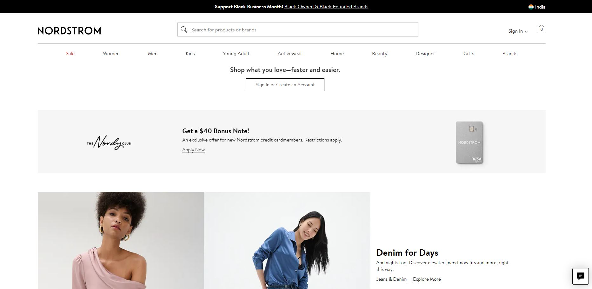
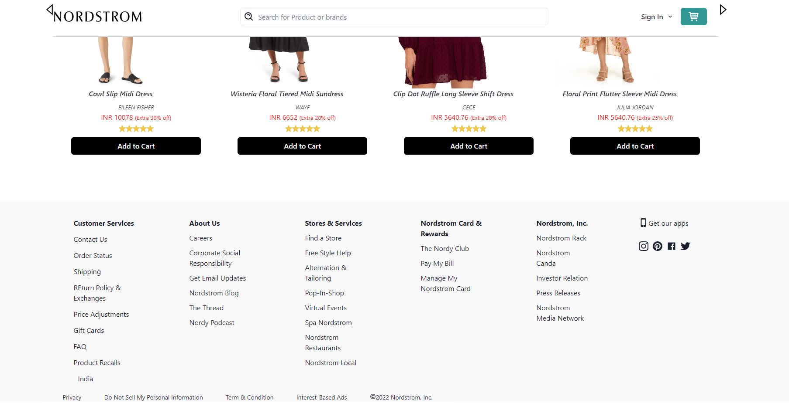
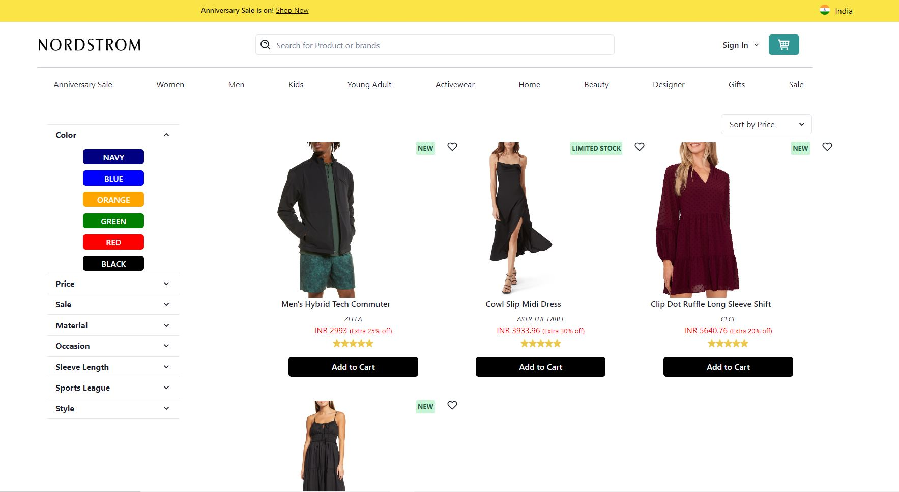

# links

# Project-Nordstrom-clone

Nordstrom is a fashion E-commerce website with variety of fashion product like clothing , jackets, shoes, for different category like men, women and kid.

\*I was given a task to Clone the nordstrom.com Website.\*\*

# To visit our website [Click here](https://nordstrom-manoj.vercel.app/)

## NPM Packages used

- ### react 

- ### react-router-dom 
- ### axios 

- ### create-react-app 

- ### iconify/react
- ### react-redux
- ### react-slick 

## Technologies Used

  <a href="https://reactjs.org/" target="_blank"> &nbsp;&nbsp;&nbsp;&nbsp;&nbsp;</a>
    <a href="https://developer.mozilla.org/en-US/docs/Web/JavaScript" target="_blank">  &nbsp;&nbsp;&nbsp;&nbsp;&nbsp; </a> 
    <a href="https://www.w3.org/html/" target="_blank"> &nbsp;&nbsp;&nbsp;&nbsp;&nbsp;</a>
    <a href="https://www.w3schools.com/css/" target="_blank">  &nbsp;&nbsp;&nbsp;&nbsp;&nbsp;</a> 
    <a href="https://redux.js.org" target="_blank"> &nbsp;&nbsp;&nbsp;&nbsp;&nbsp;</a> 
  

  

## Features

- Fullscreen mode

### We have focused mainly on:

1.Landing Page

<h4>This is our landing page </h4>

2.Sign-In Page

<h4>Here user can Signin:- </h4>

3.Product Page

<h4>Here user can search and filter the data as per their requirement and add to cart:- </h4>

## Team Member

- [@Manoj attri](https://github.com/manojattri181)
